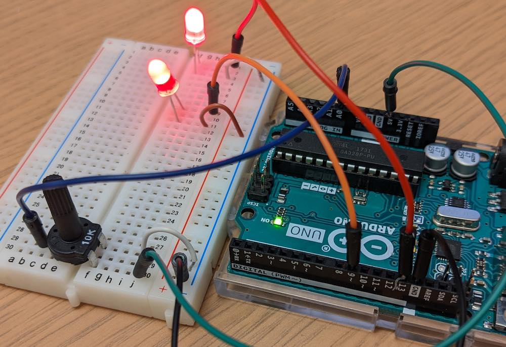

# SysMLv2 + Temp Control + Firmata4j + Uno example



Potentiometer simulates a temp sensor.  It's range is set to be b/w 70 F and 100 F.

Row 9 LED uses PWM to display the current temperature.  It's off at 70 F
and fully bright at 100 F.

Row 1 LED shows fan state, either on or off.  If should turn on if
the temperature rises above 90 F and should turn off when temperature
drops below 80 F.

# How to Build

1. Install [Arduino IDE 2.0](https://docs.arduino.cc/software/ide-v2/tutorials/getting-started/ide-v2-downloading-and-installing)

1. Plugin in the Uno, launch the IDE, and then select the board making
note of its port (e.g. it will look something like ``/dev/cu.usbmodem14301``)

1. Select ``File >> Examples >> Firmata >> StandardFirmata`` and upload
that to the board

1. Do the following:

    ```
    cd hamr/slang
    sireum proyek ive .
    ```

1. Open [hamr/slang](hamr/slang) in IVE

1. Change [DeviceBridge.port](hamr/slang/src/main/component/tc/TempControlAadl/device/DeviceBridge.scala#L8) so that it matches the board's port

1. Run the [Demo](hamr/slang/src/main/architecture/tc/Demo.scala) app
